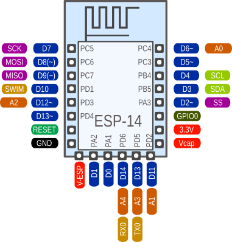

# ESP-14

An ESP-8266 Wifi-Controller together with a STM8S003 CPU for about $2 -
incredible.  Since the STM8S003 is almost identical to the STM8S103 used on
the [STM8S103 breakout boards](stm8blue.md) all software runs here as well.

Using the same pin numbering scheme as with the stm8blue boards it looks
like this:

## Differences between the '003 and the '103 CPUs

Very slim. All differences that I could find so far:

Feature		| STM8S003	| STM8S103
------------	| -------------	| ------------
EEPROM size	| 128 Bytes	| 640 Bytes

I am not sure why the '003 is sold for half the price, or, to put it the
other way around, why anybody should choose the '103 at all. Did I miss an
important difference?

## Using the Wifi connection

The ESP-14 is basically an ESP-01 Wifi-module together with a STM8S breakout
board combined into one PCB. The ESP part comes preprogrammed with the
usual ESP AT-Firmware and is connected to the RX/TX pins of the STM8S.

It feels like having a classic ATmega8-Arduino with a build-in ESP-01
module. Using the [WiFiEsp library](https://github.com/bportaluri/WiFiEsp)
we could have a programming experience very similar to using an Arduino with
a Wifi-shield or an Arduino Yun.

The main problem is the limited flash space of the '003. Even the very basic
WebServer example that comes with the WiFiEsp library needs more then 14kB
flash and more than 1kB RAM when compiled for an Arduino Uno. Even if the
library could be carefully optimized to fit into the 8kB flash of an '003 -
there would be no space left for the actual user code.

It is still possible to do very simple task by just sending AT-strings to
the ESP. But here we are definitly leaving Ardunio territory. Here we have
to start from scratch and do it all by ourself. This is not going to be
beginner-friendly anymore.

The major remaining advantage of the STM8S over the ESP is power efficiency.
The STM8S runs on almost nothing, while the ESP draws anything between 50
and 200mA even for the simplest tasks.

In most cases you might want to implement the external communication part of
the application on the ESP, using the
[ESP8266 Arduino port](https://github.com/esp8266/Arduino).

The STM8S is better suited to local control and measurement and other
energy- and time-critical tasks. Both CPUs use separate power supply inputs.
Using an additional PMOS transistor the STM8S could control the power supply
for the ESP and help extending battery life by activating the big brother
only when its services are actually required.

## Poor design choice

Overall, the '003 is a very questionable CPU choice by AI Thinker. The '003
is clearly one of the cheapest CPUs on the market, but the applications for
this module are heavily restricted the the small flash memory.

Why didn't they use an ATmega328? Just one dollar more and the whole Arduino
universe opens up. Or at least an STM8S005K6T6C, offering 32kB flash and 2kB
RAM for only 40 cents more, if you want to go really cheap.

And why would you need an external PMOS to control the ESP power supply?
Why is this not included on the PCB already? This could the big killer
feature of the current combination.

## The upside

Having a beefy 32 bit CPU and using it as an I/O-coprocessor while running
the main application on an resticted 8-bitter is a weired concept. Things
like the Arduino Yun or the Arduino WiFi-shield don't make too much sense.

It is much more sensible to use the big CPU to control the small one than
the other way around. Maybe this board can help to promote that concept.
