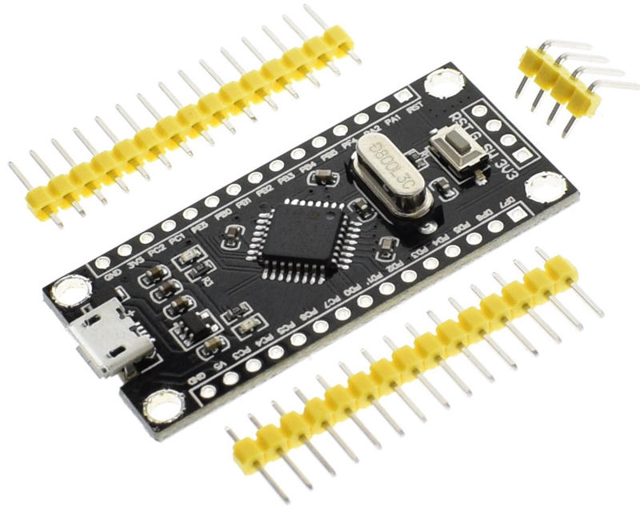
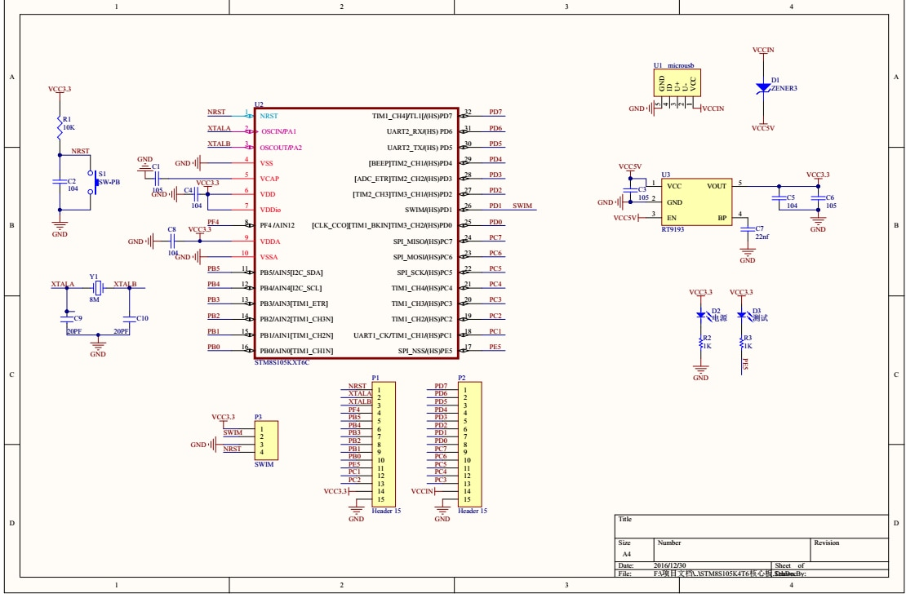
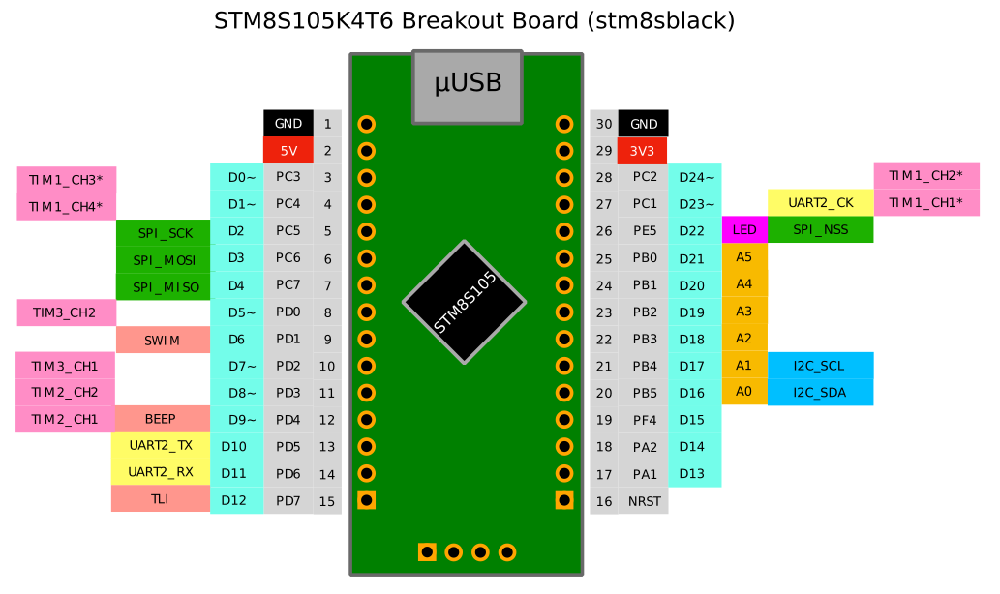

# Generic STM8S105 breakout board

These simple breakout boards are are available on aliexpress and the other
usual china web sites as "stm8s105k4t6 development board" for $1.60
including shipping.

STM8S105K4T6 microcontroller, 16 KB Flash, 2 KB RAM, 1 KB EEPROM 

  - LED on PE5, active low.
  - external crystal 8MHz on PA1/PA2 or internal oszillator with 16 MHz
  - build-in serial bootloader
  - all I/O-pins accessible on header pins
  - mounting position for 4 pin SWIM connector (for ST-Link flash tool)
  - micro-USB connector for power supply only (data lines not connected)
  - 3.3V I/O voltage, regulator on board

These boards are the bigger brother of the [STM8S103 breakout
boards](stm8blue.md) with more I/O lines, more flash and more EEPROM. They
are build around a CPU STM8S105K4T6 with 16MHz internal oscillator, 16kB
flash, 2kB RAM, and 1kB EEPROM. The CPU includes a UART, SPI, I2C, PWM, 10
bit ADC, 3 timer, and up to 25 I/O pins - almost like an Arduino Nano, but
only half the flash space.

One (red) LED is connected to GPIO PE5. The push button is for reset. The
CPU runs on 3.3V, a linear regulator is integrated on the board. The micro
USB connector is only for (5V) power supply, the data lines are not
connected.

All CPU pins are easily accessible on (optional) pin headers (pitch 2.54mm,
perfect for breadboards).

## I2C not easy accessible

Unfortunatly, I2C is only available as an alternate pin function on this
CPU. So far, there is no support in Sduino for handling the alternate
function remapping bits in the option byte.

It is possible to modify these configuration registers via SWIM using a
flash tool and stm8flash, but you are on your own there.

## Connection to the flash tool

I am using the ST-Link V2 compatible flash tool in the green plastic
housing. The one in the metal housing uses a different pinout.

Connection to the flashtool:

Signal name	|P3 on CPU board	|Green flash tool|Metal flash tool
------ 		|:-----:		|:-----: 	|:-----:
3V3    		|1      		|2      	| 7
SWIM   		|2      		|5      	| 5
GND    		|3      		|7      	| 3
NRST   		|4      		|9      	| 1

## Pin number mappings

The Arduino environment uses its own pin numbering scheme independent from
the physical CPU pin numbers. Many Arduino sketches and libraries contain
hard-coded assumptions about the number of pins with special functions.
Ideally, all these numbers would be the same and all programs could be
compiled without changes.

Unfortunatly, it turns out that a perfect mapping is not possible.

In the end I chose a simple geometric numbering for the module. The
numbering is similar to a classic DIP package with the USB connector as the
pin 1 marking. It starts with port pin PC3 and counting up from 0. This
results in this mapping:

sduino pin	| STM8S105 CPU port pin
----------	| ---------------------
 0-4		| PC3-PC7
 5-12		| PD0-PD7
13,14		| PA1-PA2, connected to the 8 MHz crystal, weak output drivers
16-21		| PB5-PB0 (reverse order, weak output drivers)
 22		| PE5, weak output driver
 23,24		| PC1-PC2, weak output drivers

- serial: 10,11
- SPI: 2,3,4,22
- I2C: 16,17 (has to be activated as an alternative function first)
- Analog: 16-21
- PWM: 0,1,5,7-9,23,24
- LED: 22

pros of this approach:

- Easy and logical for use on a breadboard
- Very clear and logical port pin ordering

cons of this approach:

- All functions use totally different pin numbers than Arduino

I am still not really happy with this mapping. Instead of simplifing things
it only adds another layer of abstraction and confusion. To avoid this I
added definitions for the regular CPU pin names like `PA1` and `PD2`. In the
end, this notation seems to be a lot easier to me. I am open for suggestions
for a better pin number mapping.

The chosen pin mapping for the STM8S105K (possible alternate function in
paratheses):

|Phys. STM8 pin|Name	|Functions	|Geometrical mapping|special funcion
|---:	|---	|---			| ---	|---
|2	|PA1	|(OscIn, no HS)		|13	|
|3	|PA2	|(OscOut, no HS)	|14	|
|8	|PF4	|Ain12 (not supported, no HS)|15	|
|11	|PB5	|Ain5, [SDA], no HS	|16	|Analog A0
|12	|PB4	|Ain4, [SCL], no HS	|17	|Analog A1
|13	|PB3	|Ain3, no HS		|18	|Analog A2
|14	|PB2	|Ain2, no HS		|19	|Analog A3
|15	|PB1	|Ain1, no HS		|20	|Analog A4
|16	|PB0	|Ain0, no HS		|21	|Analog A5
|17	|PE5	|SPI_NSS, no HS		|22	|LED
|18	|PC1	|T1-1			|23	|PWM
|19	|PC2	|T1-2			|24	|PWM
|20	|PC3	|T1-3			|0	|PWM
|21	|PC4	|T1-4			|1	|PWM
|22	|PC5	|SCK			|2	|
|23	|PC6	|MOSI			|3	|
|24	|PC7	|MISO			|4	|
|25	|PD0	|T3-2			|5	|PWM
|26	|PD1	|SWIM			|6	|
|27	|PD2	|T3-1			|7	|PWM
|28	|PD3	|T2-2			|8	|PWM
|29	|PD4	|T2-1/Beep		|9	|PWM
|30	|PD5	|TX			|10	|
|31	|PD6	|RX			|11	|
|32	|PD7	|TLI			|12	|

## Special pins

Most pins on the right side are weaker than the other pins. Try avoiding
these pins for LEDs and other higher current applications: D13-D22 (PA1/PA2,
PF4, PB5-PB0, PE5)
